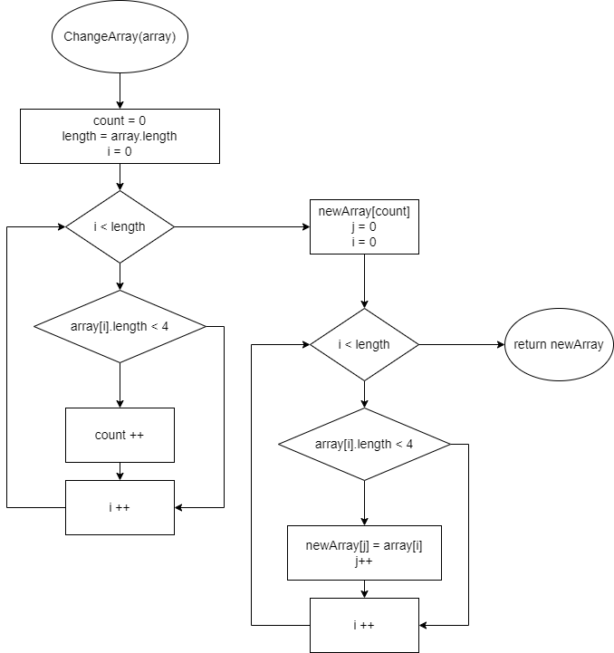

# Итоговая проверочная работа
*Задача: Написать программу, которая из имеющегося массива строк формирует новый массив из строк, 
длина которых меньше, либо равна 3 символам. Первоначальный массив можно ввести с клавиатуры, 
либо задать на старте выполнения алгоритма. При решении не рекомендуется пользоваться коллекциями, 
лучше обойтись исключительно массивами.*

1. Задан массив;
2. Создан метод PrintArray, который будет выводить массив на экран;
3. Создаю метод ChangeArray выполняющий условия задачи:
  * первый цикл выбирает строки из массива длина которых меньше, либо равна 3 символам и подсчитывает их количество;
  * создан новый массив длинной в подсчитанное количесво;
  * заполнен новый массив только строками длина которых меньше, либо равна 3 символам;
4. Запускается метод и выводится результат на экран.

     
[КОД](Program.cs)